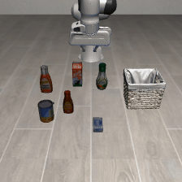
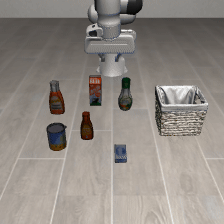
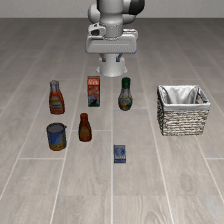
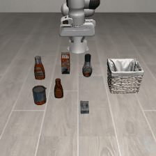
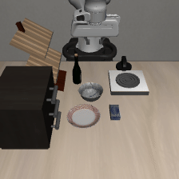
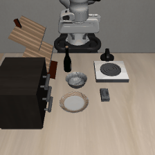
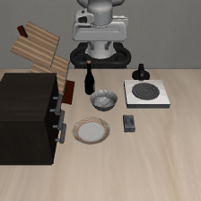
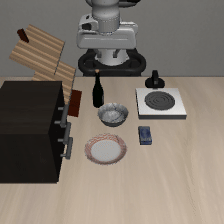
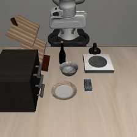
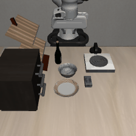

# Evidence-Guided Counterfactual Learning for Long-Tailed Robotic Policies

**ECL** trains a robot policy to use task-specific visual evidence under long-tailed demonstration distributions. This package contains the MiniVLA implementation, LIBERO-Core data preparation, training, factual-only evaluation, and simulation demos for the accompanying manuscript.

[Method and protocol notes](docs/METHOD_AND_PROTOCOL.md) · [Demo guide](examples/README.md)

The dataset construction and rollout implementation are based on [VLA-long-tail](https://github.com/MLDXY/VLA-long-tail). ECL uses **LIBERO-Core-LT directly**. This folder is self-contained with respect to source code; external datasets and pretrained weights are downloaded separately.

## Release coverage

| Component | Included |
| --- | --- |
| MiniVLA + ECL / LIBERO-Core | Training implementation, data pipeline, evaluation, CPU tests |
| FULL / LT baselines | Inherited MiniVLA training code and commands below |
| π₀.₅ + ECL / LIBERO-Core-LT | Pinned OpenPI overlay, data conversion, training and evaluation entry points in [`supplementary/pi05/`](supplementary/pi05/README.md) |
| Simulation demos | 80 GIFs covering the complete task/model/method grid. See the [simulation gallery](examples/simulation/README.md) |


## 1. Installation

Use **Linux, Python 3.10, and an NVIDIA GPU with BF16 support**. The default experiment uses one GPU and a global batch of 20. Available memory must accommodate the extra training forwards; use gradient accumulation below if needed. The commands use Bash.

```bash
cd ECL-long-tail
conda create -n ecl python=3.10 -y
conda activate ecl

# Ubuntu system packages for headless simulation; install with administrator rights.
sudo apt-get update
sudo apt-get install -y libosmesa6-dev libgl1-mesa-glx libglfw3 patchelf ffmpeg unzip

pip install torch==2.3.1 torchvision==0.18.1 torchaudio==2.3.1 \
  --index-url https://download.pytorch.org/whl/cu118
pip install -r requirements-ecl.txt
pip install -e LIBERO --no-deps

export PYTHONPATH="$PWD:$PWD/experiments/ecl${PYTHONPATH:+:$PYTHONPATH}"
export PRISMATIC_DATA_ROOT="$PWD/tensorflow_datasets"
export LIBERO_CONFIG_PATH="$PWD/.libero"
export MUJOCO_GL=osmesa
python scripts/ecl/configure_libero.py
python scripts/ecl/self_check.py
pip check
pip freeze > environment-freeze.txt
```

`requirements-ecl.txt` combines the simulator and policy dependencies. Do not install the older, conflicting `LIBERO/requirements.txt` over it. FlashAttention is not required: evidence selection needs explicit attention weights. Preserve `environment-freeze.txt` with an experimental release; the inherited `dlimp` dependency uses a Git URL and is resolved to a commit in the freeze output.

## 2. Pretrained MiniVLA

Download the public [MiniVLA LIBERO-90 checkpoint](https://huggingface.co/Stanford-ILIAD/minivla-libero90-prismatic/tree/main/checkpoints), including its configuration and action-normalization metadata:

```bash
python scripts/ecl/download_pretrained.py
```

The script records the resolved Hugging Face commit in `download_manifest.json`. To reuse that revision, pass `--revision COMMIT_SHA`.

```text
pretrained/minivla-libero90-prismatic/
├── config.json
├── dataset_statistics.json
├── download_manifest.json
└── checkpoints/step-122500-epoch-55-loss=0.0743.pt
```

If model access requires authentication, set `HF_TOKEN` in your environment. Training and evaluation also require access to the backbone model/tokenizer files or a populated local Hugging Face cache. A checkpoint `.pt` alone is insufficient.

## 3. Dataset preparation

### Download LIBERO

Use the three original task suites from [LIBERO](https://libero-project.github.io/datasets). The bundled download utility has separate Spatial, Object, and Goal URLs.

```bash
mkdir -p libero_raw
python - <<'PY'
from libero.libero.utils.download_utils import libero_dataset_download
for suite in ("libero_spatial", "libero_object", "libero_goal"):
    libero_dataset_download(datasets=suite, download_dir="libero_raw")
PY
```

Expected input: `libero_raw/{libero_spatial,libero_object,libero_goal}/*.hdf5`.

### Regenerate, select Core tasks, and subsample LT

```bash
NUM_GPUS=1 MAX_PROCESSES=1 bash scripts/ecl/prepare_data.sh
```

The wrapper runs the same stages as VLA-long-tail. They can also be executed separately:

```bash
for suite in libero_spatial libero_object libero_goal; do
  python scripts/dataset/parallel_libero_dataset_regenerator.py \
    --num-gpus 1 --max-processes 1 --libero-task-suite "$suite" \
    --libero-raw-data-dir "libero_raw/$suite" \
    --libero-target-dir "dataset_all/${suite}_no_noops"
done
python scripts/dataset/create_libero_core_full.py --dataset_root dataset_all
python scripts/dataset/create_libero_core_lt.py \
  --source_dir dataset_all/libero_core_full_no_noops --seed 100
python scripts/ecl/check_dataset.py --variant full
python scripts/ecl/check_dataset.py --variant lt
```

Checks stop on missing tasks or unexpected demonstration counts. Each directory receives a manifest containing demonstration IDs, frame counts and SHA-256 hashes, plus `task_counts.json`. Retain these files to compare independently regenerated datasets.

| Task ID | Language instruction | FULL | LT |
| --- | --- | ---: | ---: |
| 0 | Pick up the black bowl next to the plate and place it on the plate | 46 | 46 |
| 1 | Pick up the black bowl next to the cookie box and place it on the plate | 47 | 28 |
| 2 | Pick up the black bowl on the cookie box and place it on the plate | 45 | 19 |
| 3 | Pick up the ketchup and place it in the basket | 42 | 15 |
| 4 | Pick up the alphabet soup and place it in the basket | 47 | 11 |
| 5 | Push the plate to the front of the stove | 39 | 9 |
| 6 | Put the bowl on top of the cabinet | 47 | 8 |
| 7 | Put the cream cheese in the bowl | 39 | 7 |
| 8 | Put the wine bottle on top of the cabinet | 45 | 6 |
| 9 | Put the wine bottle on the rack | 38 | 5 |
| **Total** | | **435** | **154** |

### Convert HDF5 to RLDS

```bash
bash scripts/ecl/build_rlds.sh
```

The builders read `LIBERO_CORE_FULL_HDF5` and `LIBERO_CORE_LT_HDF5`; editing Python source paths is unnecessary. Output defaults to `tensorflow_datasets/{libero_core_full,libero_core_lt}/1.0.0/`.

```bash
# Optional custom locations; use absolute paths.
LIBERO_CORE_FULL_HDF5=/data/core_full \
LIBERO_CORE_LT_HDF5=/data/core_lt \
TFDS_DATA_DIR=/data/tensorflow_datasets bash scripts/ecl/build_rlds.sh
```

ECL has no separate augmented RLDS dataset. Its data mix and action-normalization key are both `libero_core_lt`.

## 4. ECL method

The selector ranks visual tokens by the product of object-related and causal action-prediction attention. The top 10% of projected visual tokens are replaced by the mean of the unselected tokens. The instruction stays unchanged.

```math
z^+ = f_\theta(I,L),\qquad z^- = f_\theta(I_{\neg R},L),\qquad
z^{\mathrm{effect}} = z^+ - \lambda z^-
```

```math
r_i = \frac{N_{\max}-N_i}{N_{\max}-N_{\min}},\qquad
\mathcal L_i = \mathcal L_{\mathrm{BC}} + \mu\mathcal L_{\mathrm{mask}} + r_i\mathcal L_{\mathrm{CF}}
```

`N_i` counts demonstrations, not frames. The weighted CF loss is averaged across samples **without dividing by the sum of rarity weights**. The most frequent task has zero CF weight and still receives BC and masked supervision. The selector is a separate no-gradient forward. Deployment uses only the ordinary `predict_action()` policy.

The implementation follows the displayed formula with gradients through both branches. `--stop-gradient` enables a detached-negative-branch ablation. The complete configuration is documented in [method notes](docs/METHOD_AND_PROTOCOL.md).

## 5. Training

First check that real data and checkpoint loading, masking, backward, and checkpoint saving work:

```bash
bash scripts/ecl/smoke_test.sh
```

This command performs a two-step training pipeline check with warm-up disabled.

Run the main configuration:

```bash
bash scripts/ecl/train.sh \
  --run-name ecl_libero_core_s7 \
  --task-counts dataset_all/libero_core_lt_no_noops/task_counts.json
```

Defaults are in [configs/ecl_libero_core.json](configs/ecl_libero_core.json). Explicit CLI arguments override them.

| Setting | Value | Source |
| --- | --- | --- |
| Contrast coefficient λ | 0.3 | Manuscript |
| Mask ratio | 0.10 (26 of 256 patches) | Manuscript |
| CF weight | Per-sample rarity | Manuscript equation |
| Masked loss μ | 0.3 | ECL main-experiment value, confirmed by the author |
| BC warm-up | 2 epochs | Manuscript training-cost appendix / supplied training code |
| Epochs / global batch | 36 / 20 | ECL training configuration; batch matches manuscript appendix |
| Learning rate / scheduler | 1e-5 / constant | Inherited LIBERO-Core MiniVLA configuration |
| Attention aggregation | Last 4 layers, mean over heads | ECL training configuration |
| Training seed | 7 | ECL training configuration |
| Image augmentation | Off | Supplied matched training code |

At 19,234 frames, 36 epochs and global batch 20, training uses 34,621 optimizer steps with a 1,923-step warm-up.

Useful variants:

```bash
# Smaller physical batch, same global batch via gradient accumulation.
bash scripts/ecl/train.sh --per-device-batch-size 5 --global-batch-size 20

# Custom data / initialization.
bash scripts/ecl/train.sh --data-root /data/tensorflow_datasets \
  --pretrained-checkpoint /models/minivla/checkpoints/step-122500-epoch-55-loss=0.0743.pt

# Resume into a NEW run directory; scheduler and optimizer are restored.
bash scripts/ecl/train.sh --run-name ecl_resumed \
  --resume-checkpoint runs/miniVLA_libero_core_lt_ecl/ecl_libero_core_s7/checkpoints/step-010000-epoch-10-loss=YOUR_LOSS.pt

# Coefficient / mask-budget ablations (keep other settings fixed).
bash scripts/ecl/train.sh --lambda-value 0.2 --run-name ecl_lambda02
bash scripts/ecl/train.sh --top-ratio 0.05 --run-name ecl_mask005
bash scripts/ecl/train.sh --mu 0.1 --run-name ecl_mu01
```

Use an actual numbered filename for resume. The single-GPU configuration is the primary reproduction target.

Each run under `runs/miniVLA_libero_core_lt_ecl/` saves `config.json`, `method_config.json`, `task_counts.json`, `dataset_statistics.json`, `ecl_metrics.jsonl`, and `checkpoints/`. Keep the whole run directory for evaluation. Metrics include factual action accuracy and the rarity-weighted CF loss.

### FULL and LT comparisons

The inherited trainer supports both data variants. For the paper-sized global batch:

```bash
export HF_TOKEN="${HF_TOKEN:-}"
VARIANT=lt  # full or lt
torchrun --standalone --nnodes 1 --nproc-per-node 1 vla_scripts/train.py \
  --vla.type "prism-qwen25-dinosiglip-224px+0_5b+mx-libero-core-${VARIANT}" \
  --vla.expected_world_size 1 --vla.per_device_batch_size 20 --vla.global_batch_size 20 \
  --vla.epochs 36 --hf_token HF_TOKEN --seed 7 \
  --pretrained_checkpoint pretrained/minivla-libero90-prismatic/checkpoints/step-122500-epoch-55-loss=0.0743.pt \
  --data_root_dir tensorflow_datasets --run_root_dir "runs/baseline_${VARIANT}" \
  --run_id "minivla_${VARIANT}_s7"
```

## 6. Evaluation

```bash
# Quick simulator check.
bash scripts/ecl/evaluate.sh \
  --run-dir runs/miniVLA_libero_core_lt_ecl/ecl_libero_core_s7 \
  --seeds 7 --num-trials-per-task 2 --task-ids 0,9

# Main table protocol: 3 seeds × 75 episodes = 225 episodes/task.
bash scripts/ecl/evaluate.sh \
  --run-dir runs/miniVLA_libero_core_lt_ecl/ecl_libero_core_s7 \
  --seeds 7,14,21 --num-trials-per-task 75 --gpu-id 0
```

The evaluation protocol uses **225 episodes per task**, consisting of 75 episodes for each of seeds 7, 14 and 21.

Evaluation keeps the original LIBERO-Core environment, image processing, action denormalization, gripper conversion, success criterion, 10 settling steps and 350 policy-step limit. Initial states follow seeded shuffled cycles because each seed uses 75 episodes, exceeding the usual 50 stored states. IDs are saved for every episode and reused across methods when seeds match.

The evaluator loads **one model on one GPU**, runs the seeds sequentially, and uses factual-only inference. It supports `--step N` (otherwise latest numbered checkpoint), `--save-root PATH`, and `--unnorm-key libero_core_full` for FULL checkpoints. Use the same evaluator and budget for all comparisons.

Outputs under `results/ecl/`:

- `evaluation_config.json`: checkpoint, seeds, task IDs, complete initial-state plan, horizon and inference mode.
- `episodes.jsonl`: one record per completed episode, including success and initial-state ID.
- `aggregate_summary.json` / `.csv`: per-task mean, binomial standard deviation of the pooled rate, and sample standard deviation across seed rates; macro mean and seed standard deviation.
- `seed_*/.../*.gif`: rollout videos from the inherited renderer.

Rates in machine-readable outputs are fractions in `[0,1]`; multiply by 100 for percentages. An incomplete or duplicate episode set cannot produce a summary.

## 7. Demos

The simulation demos cover **all 10 LIBERO-Core tasks** for **MiniVLA and π₀.₅**, comparing **FULL, LT, APA and ECL** for each task. Task directory names use the exact English instructions from the paper, with spaces replaced by underscores. The structure is `examples/simulation/task_ID_instruction/model/method/demo.gif`. Browse the [complete comparison gallery](examples/simulation/README.md).

**Previews by backbone.** These are qualitative rollouts; quantitative results require the complete evaluation records.

| Backbone / task | FULL | LT | APA | ECL |
| --- | --- | --- | --- | --- |
| MiniVLA — 3: Ketchup → basket |  |  |  |  |
| MiniVLA — 5: Plate → front of stove |  |  |  |  |
| π₀.₅ — 8: Wine bottle → cabinet |  |  |  |  |
| π₀.₅ — 9: Wine bottle → rack |  |  |  |  |

See the [demo guide](examples/README.md) for the task-first file structure.

## Acknowledgements and attribution

This code builds on [VLA-long-tail](https://github.com/MLDXY/VLA-long-tail), [MiniVLA / OpenVLA](https://github.com/Stanford-ILIAD/openvla-mini), and [LIBERO](https://github.com/Lifelong-Robot-Learning/LIBERO). Third-party notices and existing licenses are retained.

Citation metadata for the anonymous ECL manuscript will be added with the final publication information.
